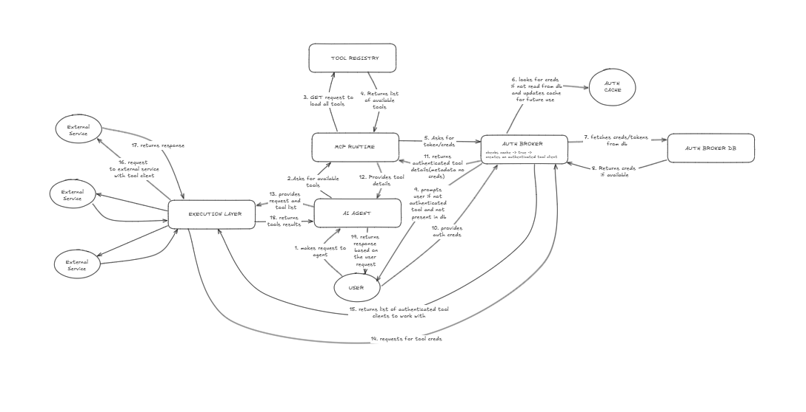

# OpenTool

> One MCP server. All your tools. Fully open-source and self-hosted.

OpenTool gives AI agents secure, authenticated access to your tools via a single MCP connection. Connect GitHub, Notion, Slack, and more — then point any MCP-compatible agent at OpenTool with one API key.

Built for solo developers building with AI agents.

[](https://www.npmjs.com/package/opentool-cli)
[](https://www.npmjs.com/package/@opentool-ts/sdk)
[](https://pypi.org/project/opentool-sdk/)
[](LICENSE)

<p align="center">
  
</p>
<p align="center"><em>The original system design sketch. Hours of research distilled into one diagram — this is what the entire project was built from.</em></p>

---

## Why OpenTool

|                            | Arcade  | Composio | OpenTool |
| -------------------------- | ------- | -------- | -------- |
| Open source                | Partial | Partial  | ✅ Full  |
| Self-hostable              | ❌      | ❌       | ✅       |
| MCP native                 | ✅      | ✅       | ✅       |
| Free forever (self-hosted) | ❌      | ❌       | ✅       |
| CLI with REPL              | ❌      | ❌       | ✅       |
| TypeScript + Python SDKs   | ✅      | ✅       | ✅       |

---

## Install

### CLI

```bash
# npm (recommended)
npm i -g opentool-cli

# or run without installing
npx opentool-cli

# or curl installer
curl -fsSL https://raw.githubusercontent.com/Aditya251610/opentool/main/install.sh | bash
```

### SDKs

```bash
# TypeScript
npm i @opentool-ts/sdk

# Python
pip install opentool-sdk
```

---

## Quickstart (Hosted)

**1. Get your API key**
Sign up at [opentool.space](https://opentool.space) → Settings → Generate API key

**2. Connect your tools**
Go to the dashboard → Tools → Connect GitHub, Notion, Slack etc.

**3. Connect your agent**

For VS Code / Copilot / Claude Code, add to `mcp.json`:

```json
{
  "servers": {
    "opentool": {
      "type": "http",
      "url": "https://opentool.onrender.com/mcp",
      "headers": {
        "Authorization": "Bearer <TOKEN>"
      }
    }
  }
}
```

**Or use the CLI:**

```bash
opentool init       # guided setup
opentool login      # authenticate
opentool tools      # see your connected tools
opentool            # launch interactive REPL
```

That's it. Your agent now has access to all your connected tools.

---

## Self-Hosting

**Prerequisites:** Docker + Docker Compose

```bash
git clone https://github.com/Aditya251610/opentool
cd opentool
cp .env.example .env
# Fill in your OAuth app credentials in .env
docker-compose up -d
```

Dashboard available at `http://localhost:3000`
MCP server available at `http://localhost:3001`

### Production Deployment

- **[Self-Hosting Guide](docs/self-hosting.md)** — Docker Compose, manual setup, reverse proxy, health checks, backups
- **[Security Guide](docs/security.md)** — Encryption, authentication, threat model, data handling

Key production checklist:

- Use HTTPS with valid SSL certificates
- Set a strong `TOKEN_ENCRYPTION_KEY` (64 hex characters)
- Configure `SERVER_URL` and `DASHBOARD_URL` for your domain
- Back up your encryption key separately from database backups
- CSP and HSTS headers are enabled by default

---

## Supported Tools

26 providers, 133 tools — and growing.

### Developer & DevOps

| Provider   | Status | Tools | Actions                                                                                                |
| ---------- | ------ | ----- | ------------------------------------------------------------------------------------------------------ |
| GitHub     | ✅     | 7     | Create issue, list issues, create PR, comment, get repo, search code, get PR diff                      |
| GitLab     | ✅     | 8     | Create issue, get issue, create MR, get MR, list MR commits, list pipelines, get pipeline jobs, search |
| Linear     | ✅     | 3     | Create issue, update status, search issues                                                             |
| Vercel     | ✅     | 2     | List deployments, get deployment                                                                       |
| Docker Hub | ✅     | 4     | Search images, get image, list tags, get vulnerabilities                                               |
| Sentry     | ✅     | 7     | List orgs, list projects, list/get/resolve issues, get event, search                                   |

### Cloud Platforms

| Provider   | Status | Tools | Actions                                                                                  |
| ---------- | ------ | ----- | ---------------------------------------------------------------------------------------- |
| AWS        | ✅     | 8     | List EC2/S3/Lambda/EKS, describe EC2, list S3 objects, invoke Lambda, CloudWatch metrics |
| GCP        | ✅     | 7     | List instances/GKE/functions/buckets, get instance, list bucket objects, get project     |
| Azure      | ✅     | 7     | List subscriptions/resource groups/VMs/AKS/storage/functions, get VM                     |
| Cloudflare | ✅     | 6     | List zones/DNS/workers, create/update DNS, purge cache                                   |

### Productivity & Communication

| Provider        | Status | Tools | Actions                                                                                |
| --------------- | ------ | ----- | -------------------------------------------------------------------------------------- |
| Gmail           | ✅     | 3     | Send, read, search emails                                                              |
| Google Calendar | ✅     | 2     | Create event, list events                                                              |
| Google Drive    | ✅     | 6     | List/search/get/create/share/delete files                                              |
| Google Meet     | ✅     | 3     | Create/list/get meetings                                                               |
| Microsoft 365   | ✅     | 8     | List/send/search emails, list/create events, list teams/channels, send channel message |
| Notion          | ✅     | 3     | Create page, query database, update block                                              |
| Slack           | ✅     | 3     | Send message, read channel, search messages                                            |
| Jira            | ✅     | 7     | List projects, search/get/create/update issues, add comment, list transitions          |
| Confluence      | ✅     | 6     | List spaces/pages, search content, get/create/update page                              |

### Messaging & Notifications

| Provider | Status | Tools | Actions                                            |
| -------- | ------ | ----- | -------------------------------------------------- |
| Telegram | ✅     | 5     | Get bot info, send message/photo, get updates/chat |
| Discord  | ✅     | 5     | List guilds/channels, send/get/list messages       |
| Twilio   | ✅     | 4     | Send SMS/WhatsApp, list/get messages               |

### Payments & Data

| Provider   | Status | Tools | Actions                                                                                 |
| ---------- | ------ | ----- | --------------------------------------------------------------------------------------- |
| Stripe     | ✅     | 2     | Create payment link, list customers                                                     |
| PayPal     | ✅     | 8     | Create/list/send invoices, create/get orders, refund, list transactions, create product |
| Resend     | ✅     | 1     | Send email                                                                              |
| PostgreSQL | ✅     | 5     | Execute query, list tables, describe table, run transaction, explain query              |

Want a tool added? [Open an issue](https://github.com/Aditya251610/opentool/issues) or [contribute a tool](#contributing-a-tool).

---

## CLI

The CLI ships with an interactive REPL and scriptable subcommands:

```bash
opentool                    # Launch interactive REPL
opentool tools --json       # List tools (machine-readable)
opentool exec github.list_issues --args '{"owner":"me","repo":"myrepo"}'
opentool doctor             # Run 9-point diagnostics
opentool completion --install  # Shell completions (bash/zsh/fish)
```

**REPL features:** Tab completion, ghost-text suggestions, Ctrl+R history search, fuzzy "did you mean?", readline keybindings, update notifications.

Full reference: [docs/cli-reference.md](docs/cli-reference.md)

---

## Project Structure

```
opentool/
├── apps/
│   ├── server/          # MCP server + Auth broker + REST API (Hono)
│   │   └── tools/       # Tool definitions (26 providers, 133 tools)
│   └── dashboard/       # Next.js dashboard
├── packages/
│   ├── cli/             # opentool-cli — interactive CLI + REPL
│   ├── sdk/ts/          # @opentool-ts/sdk — TypeScript SDK
│   ├── sdk/python/      # opentool — Python SDK
│   └── tool-schema/     # Shared tool definition types
├── install.sh           # curl | sh installer
└── docker-compose.yml
```

---

## Contributing a Tool

Tools are self-contained modules in `apps/server/tools/`. Each tool exports:

```typescript
import { defineTool } from '@opentool/tool-schema'

export const myTool = defineTool({
  id: 'my-tool.action',
  name: 'My Tool Action',
  description: 'What this tool does',
  authType: 'oauth2',
  inputSchema: z.object({
    param: z.string().describe('What this param does'),
  }),
  execute: async ({ input, auth }) => {
    // auth.accessToken available here
    // return result
  },
})
```

1. Fork the repo
2. Add your tool in `apps/server/tools/yourprovider/`
3. Register it in `apps/server/src/registry/index.ts`
4. Add OAuth config in `.env.example`
5. Open a PR

Full guide: [docs/contributing-a-tool.md](docs/contributing-a-tool.md)

---

## Tech Stack

- **Server** — Hono, TypeScript, Prisma, Postgres, Redis
- **Dashboard** — Next.js 14, Auth.js
- **CLI** — TypeScript, Ink (React for terminals), Commander
- **Protocol** — MCP (Model Context Protocol) TypeScript SDK + gRPC (Protocol Buffers)
- **SDKs** — TypeScript ([npm](https://www.npmjs.com/package/@opentool-ts/sdk)) + Python ([PyPI](https://pypi.org/project/opentool-sdk/))
- **Monorepo** — Turborepo + pnpm
- **Security** — AES-256-GCM encryption, CSP/HSTS headers, session obfuscation

---

## Documentation

Full docs at [`docs/`](docs/README.md):

- [Quickstart](docs/quickstart.md) — Zero to connected tools in 5 minutes
- [Self-Hosting](docs/self-hosting.md) — Docker or manual setup
- [Configuration](docs/configuration.md) — Every env var and OAuth setup
- [Architecture](docs/architecture.md) — How it all fits together
- [Authentication](docs/authentication.md) — OAuth flows and token management
- [Tools](docs/tools.md) — All 26 providers, 133 tools
- [MCP Integration](docs/mcp-integration.md) — Claude, Cursor, any MCP client
- [SDK Reference](docs/sdk-reference.md) — TypeScript and Python
- [CLI Reference](docs/cli-reference.md) — Terminal tool management
- [API Reference](docs/api-reference.md) — Every REST endpoint
- [Contributing a Tool](docs/contributing-a-tool.md) — Add a provider in ~100 lines
- [Security](docs/security.md) — Encryption, tokens, threat model
- [Troubleshooting](docs/troubleshooting.md) — Common issues and fixes
- [gRPC Transport](docs/grpc.md) — High-performance binary transport with streaming

---

## Roadmap

- [x] Core MCP server with 26 providers, 133 tools
- [x] OAuth auth broker with token encryption
- [x] Dashboard (Next.js)
- [x] CLI with interactive REPL (`opentool-cli` on [npm](https://www.npmjs.com/package/opentool-cli))
- [x] TypeScript SDK (`@opentool-ts/sdk` on [npm](https://www.npmjs.com/package/@opentool-ts/sdk))
- [x] Python SDK (`opentool-sdk` on [PyPI](https://pypi.org/project/opentool-sdk/))
- [x] Production hardening (CSP, HSTS, retry logic, 211 tests)
- [x] CI/CD with automated releases (release-please + tag-based publishing)
- [x] curl installer (`install.sh`)
- [x] gRPC transport (streaming execution, batch tools, mTLS, Kubernetes-native)
- [x] Cloud providers (AWS, GCP, Azure)
- [x] Microsoft 365 integration (Outlook, Calendar, Teams)
- [x] Atlassian suite (Jira, Confluence)
- [x] Messaging providers (Telegram, Discord, Twilio)
- [x] PayPal payments integration
- [x] Token analytics and usage tracking
- [x] Team/org support (RBAC, invites, SSO, org-scoped keys and connections)
- [ ] Tool marketplace
- [ ] Webhook support
- [ ] Plugin system for custom tools

---

## License

MIT — use it, fork it, self-host it, build on it.
